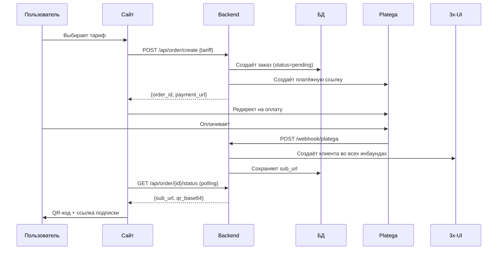

# 🚀 AWX-WEB-lite — VPN магазин

> **Версия:** 2.1  
> **Дата:** 3 августа 2026

Легковесная веб-витрина для продажи VPN-подписок с интеграцией **Platega** (оплата) + **3x-UI панель** (выдача ключей) + **Личный кабинет**.

---

## 📦 Возможности

**Backend (Python FastAPI):**
- ✅ API тарифов (`/api/tariffs`)
- ✅ Создание заказа + интеграция Platega (`/api/order/create`)
- ✅ Webhook для подтверждения оплаты (`/webhook/platega`)
- ✅ Автоматическое создание клиента в 3x-UI после оплаты
- ✅ Страница успеха с QR-кодом и sub-ссылкой
- ✅ **Личный кабинет** — JWT авторизация, управление подписками
- ✅ **Админ-панель** — dashboard, пользователи, ключи, статистика, настройки
- ✅ **Реферальная программа** — до 3 уровней, бонусные дни
- ✅ **Демо-режим** — подписка без оплаты (по паролю, для тестирования)
- ✅ **Триал** — бесплатный доступ на N дней (rate-limit 1/день)
- ✅ Верификация email (опционально)

**Frontend (HTML):**
- ✅ Главная страница с hero-секцией (Quantum тарифы)
- ✅ Карточки тарифов с автоматическими скидками
- ✅ Карточка демо-подписки (по паролю, для тестирования)
- ✅ FAQ секция
- ✅ **Личный кабинет** — вход/регистрация, подписки, ключи, QR
- ✅ Управление подпиской в ЛК: перевыпуск ключа, переименование, статистика, удаление
- ✅ **Админ-панель** (`admin.html`) — отдельное SPA с авторизацией по X-Admin-Key
- ✅ Адаптивный дизайн (mobile-first)

**База данных (SQLite + WAL):**
- Таблица `users` — аккаунты пользователей (+ блокировка, реферальный код)
- Таблица `orders` — история заказов, привязка к 3x-UI и пользователям
- Таблица `referrals` — связи «пригласил → приглашён»
- Таблица `referral_settings` — настройки реферальной программы
- Таблица `settings` — настройки, изменяемые из админ-панели

---

## ⚙️ Быстрый старт

### 1️⃣ Установка зависимостей

```bash
cd backend
python -m venv venv

# Windows
venv\Scripts\activate

# Linux/Mac
source venv/bin/activate

pip install -r requirements.txt
```

### 2️⃣ Настройка `.env`

Скопируйте `.env.example` → `.env` и заполните:

```env
# ===== 3x-UI панель =====
XUI_BASE_URL=https://your-panel-host:port/webBasePath
XUI_API_TOKEN=your_bearer_token

# Все видимые инбаунды через запятую
XUI_INBOUND_IDS=5,6,7,8,10,12,13,14

# Базовый URL subscription-сервера
XUI_SUB_BASE_URL=https://your-panel-host:2096/sub/

# ===== Platega =====
PLATEGA_MERCHANT_ID=your_merchant_id
PLATEGA_SECRET=your_api_key
PLATEGA_API_URL=https://app.platega.io

# ===== Сайт =====
SITE_BASE_URL=https://your-domain.com
DATABASE_PATH=orders.db

# ===== Авторизация =====
JWT_SECRET=your-secret-key-min-32-chars

# ===== Админ-панель =====
ADMIN_API_KEY=your-admin-api-key

# ===== CORS =====
ALLOWED_ORIGINS=["https://your-domain.com"]

# ===== Email verification =====
# false — аккаунт активен сразу после регистрации
EMAIL_VERIFICATION_REQUIRED=false

# ===== Trial =====
TRIAL_ENABLED=true
TRIAL_DAYS=3
TRIAL_GB=25

# ===== Demo mode =====
# "Демо подписка" выдаёт ключ БЕЗ оплаты — ТОЛЬКО для тестирования!
DEMO_MODE=true
DEMO_PASSWORD=AxZz123@Tt
```

### 3️⃣ Запуск backend

```bash
# Development
python main.py

# Production (рекомендуется)
uvicorn main:app --host 0.0.0.0 --port 8000
```

Backend будет доступен на `http://localhost:8000`

### 4️⃣ Открытие frontend

Просто откройте `frontend/index.html` в браузере или разместите на веб-сервере.

**Важно:** В `frontend/index.html` и `frontend/account.html` измените:
```javascript
const API_BASE = 'http://localhost:8000'; // Измените на ваш домен
```

---

## 🔄 Как работает покупка



---

## 📋 API Эндпоинты

### Публичные
| Метод | Путь | Описание |
|---|---|---|
| `GET` | `/api/config` | Публичная конфигурация (`demo_mode`) |
| `GET` | `/api/tariffs` | Список тарифов |
| `POST` | `/api/order/create` | Создание заказа (→ платёжная ссылка Platega) |
| `POST` | `/api/order/demo` | Демо-заказ без оплаты (требует пароль, rate-limit 3/час) |
| `GET` | `/api/order/{id}/status` | Статус заказа (`sub_url`, QR) |
| `POST` | `/webhook/platega` | Webhook от Platega |

### Авторизация
| Метод | Путь | Описание |
|---|---|---|
| `POST` | `/api/auth/register` | Регистрация (email + пароль, опц. `referral_code`) |
| `GET` | `/api/auth/verify` | Верификация email |
| `POST` | `/api/auth/login` | Вход (email + пароль → JWT) |
| `GET` | `/api/auth/me` | Текущий пользователь |

### Личный кабинет (`/api/account`)
| Метод | Путь | Описание |
|---|---|---|
| `GET` | `/subscriptions` | Список подписок |
| `GET` | `/subscription/{id}` | Детали подписки + QR |
| `POST` | `/renew/{id}` | Продление подписки |
| `POST` | `/subscription/{id}/rekey` | Перевыпуск ключа (сохраняет остаток времени) |
| `POST` | `/subscription/{id}/rename` | Переименование подписки |
| `GET` | `/subscription/{id}/stats` | Статистика ключа (трафик, лимит, даты) |
| `DELETE` | `/subscription/{id}` | Удаление подписки |
| `GET` | `/trial` | Статус триала |
| `POST` | `/trial/activate` | Активация триала (rate-limit 1/день) |

### Реферальная программа (`/api/referral`)
| Метод | Путь | Описание |
|---|---|---|
| `GET` | `/code` | Мой реферальный код и ссылка |
| `GET` | `/stats` | Статистика (приглашено, бонусы) |
| `POST` | `/apply` | Применить реферальный код |

### Админ-панель (`/admin`, заголовок `X-Admin-Key`)
| Метод | Путь | Описание |
|---|---|---|
| `GET` | `/dashboard` | Сводка (пользователи, ключи, выручка) |
| `GET` | `/users` | Список пользователей (поиск, пагинация) |
| `GET` | `/users/{id}` | Профиль пользователя |
| `POST` | `/users/{id}/block` | Блокировка пользователя |
| `POST` | `/users/{id}/unblock` | Разблокировка |
| `GET` | `/keys` | Список ключей (фильтры) |
| `POST` | `/keys/{id}/extend` | Продление ключа |
| `POST` | `/keys/{id}/delete` | Удаление ключа |
| `GET` | `/stats` | Статистика (заказы по дням, топ тарифов, конверсия) |
| `GET` | `/settings` | Текущие настройки |
| `POST` | `/settings/tariffs` | Обновление тарифов |
| `POST` | `/settings/trial` | Настройка триала |
| `POST` | `/settings/referral` | Настройка рефералки |
| `POST` | `/settings/demo` | Вкл/выкл демо-режим |

---

## 🏠 Личный кабинет

Пользователи могут:
- Зарегистрировать аккаунт (email + пароль, опционально реферальный код)
- Войти в личный кабинет
- Просматривать все свои подписки
- Показать ключ подписки и QR-код
- Продлить активную подписку
- **Перевыпустить ключ** — старый клиент удаляется в 3x-UI, создаётся новый с тем же остатком времени
- **Переименовать подписку** (пользовательское имя)
- Посмотреть **статистику ключа** (трафик up/down, лимит, дата окончания)
- **Удалить подписку**
- Активировать **бесплатный триал** (1 раз в день, если включён)
- Участвовать в **реферальной программе** — приглашать и получать бонусные дни

Страница ЛК: `frontend/account.html`

---

## 🎮 Демо-режим (для тестирования)

Демо-подписка выдаёт ключ **без оплаты** — удобно для отладки всего сценария выдачи ключа.

- Включить: `DEMO_MODE=true` в `.env` (по умолчанию выключен).
- Кнопка **«Демо подписка»** появляется на витрине только при `demo_mode=true` (витрина читает `GET /api/config`).
- Доступ защищён паролем: `DEMO_PASSWORD` вводится в модальном окне на витрине перед выдачей ключа.
- Rate-limit: **3 демо-заказа в час** с одного IP (защита от абьюза).
- После подтверждения сразу создаётся клиент в 3x-UI, страница успеха показывает ссылку и QR.
- В продакшене установите `DEMO_MODE=false`.

**Скрыть через админ-панель без изменения кода:** Админ-панель → Настройки → Демо (тумблер). Настройка сохраняется в БД и переживает перезапуск сервера.

---

## 🤝 Реферальная программа

Пользователи могут приглашать друзей и получать бонусные дни за их оплаты.

- Каждый пользователь получает уникальный **реферальный код** (8 символов).
- Ссылка для приглашения: `https://your-domain.com/?ref=CODE` (код подставляется автоматически).
- При регистрации можно указать чужой код — привязка реферала.
- Бонусные дни начисляются **автоматически при оплате** приглашённого.
- До **3 уровней** вложенности (высокие бонусы на 1-м уровне).
- Защита от циклов и повторного применения кода.

Настройка бонусов (проценты по уровням, включение/выключение): Админ-панель → Настройки → Рефералка.

---

## 🔐 Безопасность

1. **Bearer-токен 3x-UI** — храните в `.env`, никогда не коммитьте
2. **JWT_SECRET** — сложный случайный ключ (≥32 символов), fail-fast валидация при запуске
3. **HTTPS обязателен** — без него токены летят открытым текстом
4. **CSP заголовки** — Content-Security-Policy настроен по умолчанию
5. **Rate limiting** — 10 заказов/час, 30 запросов статуса/мин, 3 демо/час
6. **XSS защита** — все пользовательские данные экранируются
7. **Демо-пароль** — доступ к демо-подписке защищён паролем (`DEMO_PASSWORD`), можно скрыть через админку
8. **Real IP** — корректное определение IP за прокси (`X-Forwarded-For` / `X-Real-IP`)

---

## 🛠️ Настройка webhook в Platega

1. Зайдите в личный кабинет Platega
2. **Настройки** → **Webhook URL**
3. Укажите: `https://your-domain.com/webhook/platega`
4. Сохраните

Если webhook не работает — сайт использует **polling** (опрашивает Platega автоматически).

---

## 🌐 Деплой на сервер

### Nginx конфигурация

```nginx
server {
    listen 443 ssl http2;
    server_name your-domain.com;

    ssl_certificate /etc/letsencrypt/live/your-domain.com/fullchain.pem;
    ssl_certificate_key /etc/letsencrypt/live/your-domain.com/privkey.pem;

    # Frontend
    location / {
        root /var/www/awx-web-lite/frontend;
        try_files $uri $uri/ /index.html;
    }

    # Backend API
    location /api/ {
        proxy_pass http://127.0.0.1:8000;
        proxy_set_header Host $host;
        proxy_set_header X-Real-IP $remote_addr;
    }

    location /webhook/ {
        proxy_pass http://127.0.0.1:8000;
        proxy_set_header Host $host;
        proxy_set_header X-Real-IP $remote_addr;
    }

    location /payment/ {
        proxy_pass http://127.0.0.1:8000;
        proxy_set_header Host $host;
        proxy_set_header X-Real-IP $remote_addr;
    }

    location /admin/ {
        proxy_pass http://127.0.0.1:8000;
        proxy_set_header Host $host;
        proxy_set_header X-Real-IP $remote_addr;
    }
}
```

### Systemd сервис (backend)

```ini
[Unit]
Description=AWX VPN Backend
After=network.target

[Service]
User=www-data
WorkingDirectory=/var/www/awx-web-lite/backend
Environment="PATH=/var/www/awx-web-lite/backend/venv/bin"
ExecStart=/var/www/awx-web-lite/backend/venv/bin/uvicorn main:app --host 127.0.0.1 --port 8000
Restart=always

[Install]
WantedBy=multi-user.target
```

---

## 📊 Структура проекта

```
AWX-WEB-lite/
├── backend/
│   ├── .env.example          # Шаблон конфигурации
│   ├── requirements.txt      # Зависимости Python
│   ├── config.py             # Настройки из .env
│   ├── auth.py               # JWT авторизация
│   ├── admin.py              # Админ-панель API
│   ├── database.py           # SQLite + миграции
│   ├── xui_client.py         # Клиент 3x-UI API
│   ├── platega_client.py     # Клиент Platega API
│   └── main.py               # FastAPI приложение
├── frontend/
│   ├── index.html            # Лендинг (витрина)
│   ├── account.html          # Личный кабинет
│   ├── admin.html            # Админ-панель (SPA)
│   ├── privacy.html          # Политика конфиденциальности
│   └── terms.html            # Пользовательское соглашение
└── start.bat                 # Быстрый старт (Windows)
```

---

## ❓ FAQ

### Как изменить тарифы?

Отредактируйте `backend/config.py`:

```python
tariffs: dict = {
    "quantum_month": {"days": 31, "price": 300, "title": "Quantum Месяц", "devices": 5, "discount": 0},
    "quantum_quarter": {"days": 93, "price": 855, "title": "Quantum 3 Месяца", "devices": 5, "discount": 5},
}
```

Или через админ-панель: `POST /admin/tariffs`

### Как добавить серверы?

В `.env` укажите ID инбаундов через запятую:

```env
XUI_INBOUND_IDS=5,6,7,8,10,12,13,14
```

### Как зайти в админ-панель?

1. Задайте `ADMIN_API_KEY` в `.env` (случайная строка, ≥16 символов)
2. Откройте `frontend/admin.html` в браузере
3. Введите ключ в поле авторизации
4. Управление: dashboard, пользователи, ключи, статистика, настройки

### Как включить демо-режим?

В `.env`:
```
DEMO_MODE=true
DEMO_PASSWORD=your-secret-password
```
На витрине появится карточка **«Демо подписка»**. После ввода пароля ключ выдаётся мгновенно без оплаты.

Для скрытия кнопки в продакшене: `DEMO_MODE=false` или через админ-панель (Настройки → Демо).

### Как работает реферальная программа?

1. Пользователь получает свой код в Личном кабинете (раздел «Реферальная программа»)
2. Приглашённые входят по `?ref=CODE`
3. При оплате приглашённого реферер получает бонусные дни
4. До 3 уровней вложенности
5. Настройка бонусов: Админ-панель → Настройки → Рефералка

---

## 📝 Лицензия

MIT License

---

**Создано:** 2 августа 2026
**Обновлено:** 3 августа 2026  
**Автор:** Claude Code
