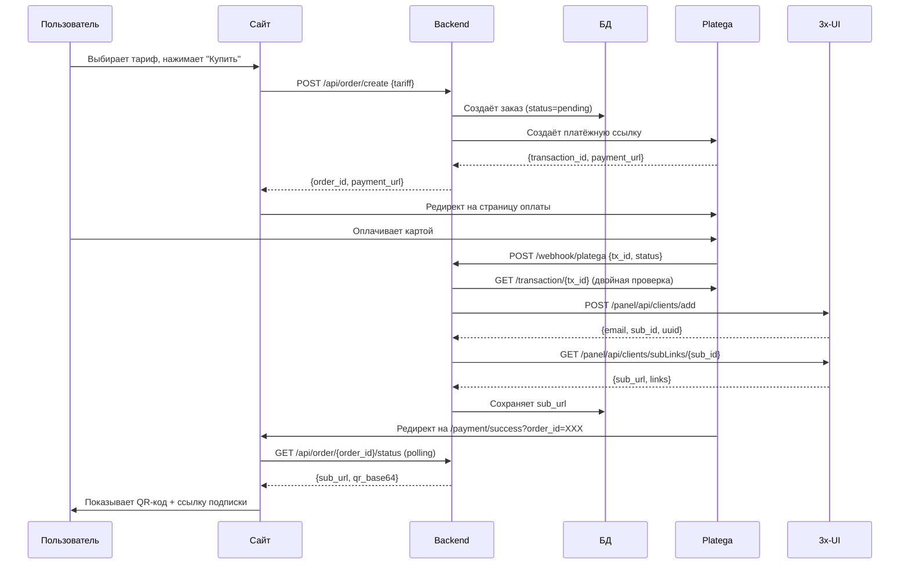

# 🚀 AWX-WEB-lite — Упрощённая витрина VPN-магазина

> **Версия:** 1.0  
> **Дата:** 2 августа 2026

Легковесная веб-витрина для продажи VPN-подписок с прямой интеграцией **Platega** (оплата) + **3x-UI панель** (выдача ключей).

---

## 📦 Что внутри

**Backend (Python FastAPI):**
- ✅ API тарифов (`/api/tariffs`)
- ✅ Создание заказа + интеграция Platega (`/api/order/create`)
- ✅ Webhook для подтверждения оплаты (`/webhook/platega`)
- ✅ Автоматическое создание клиента в 3x-UI после оплаты
- ✅ Страница успеха с QR-кодом и sub-ссылкой

**Frontend (HTML + Tailwind CSS):**
- ✅ Главная страница с hero-секцией
- ✅ Блок возможностей
- ✅ Карточки тарифов (загружаются динамически)
- ✅ FAQ секция
- ✅ Адаптивный дизайн (mobile-first)

**База данных (SQLite):**
- Таблица `orders` — история заказов, привязка к 3x-UI клиентам

---

## ⚙️ Быстрый старт

### 1️⃣ Установка зависимостей

```bash
cd backend
python -m venv venv

# Windows
venv\Scripts\activate

# Linux/Mac
source venv/bin/activate

pip install -r requirements.txt
```

### 2️⃣ Настройка `.env`

Скопируйте `.env.example` → `.env` и заполните:

```env
# ===== 3x-UI панель =====
XUI_BASE_URL=https://your-panel-url:port/webBasePath
XUI_API_TOKEN=your_bearer_token_from_panel
XUI_INBOUND_ID=18

# ===== Platega =====
PLATEGA_MERCHANT_ID=ваш_merchant_id
PLATEGA_SECRET=ваш_api_ключ
PLATEGA_API_URL=https://app.platega.io

# ===== Сайт =====
SITE_BASE_URL=https://ваш-домен.com
DATABASE_PATH=orders.db
```

### 3️⃣ Запуск backend

```bash
# Development
python main.py

# Production (рекомендуется)
uvicorn main:app --host 0.0.0.0 --port 8000
```

Backend будет доступен на `http://localhost:8000`

### 4️⃣ Открытие frontend

Просто откройте `frontend/index.html` в браузере или разместите на веб-сервере.

**Важно:** В `frontend/index.html` измените строку:
```javascript
const API_BASE = 'http://localhost:8000'; // Измените на ваш домен
```

на ваш реальный домен backend (например `https://api.awxvpn.com`).

---

## 🔄 Как работает покупка



---

## 📋 API Эндпоинты

| Метод | Путь | Описание |
|---|---|---|
| `GET` | `/api/tariffs` | Список тарифов |
| `POST` | `/api/order/create` | Создание заказа |
| `GET` | `/api/order/{id}/status` | Статус заказа + sub-ссылка |
| `POST` | `/webhook/platega` | Webhook от Platega |
| `GET` | `/payment/success` | Страница успеха (HTML) |
| `GET` | `/payment/failed` | Страница ошибки (HTML) |

---

## 🔐 Безопасность

1. **Bearer-токен 3x-UI** — храните в `.env`, никогда не коммитьте
2. **Platega Secret** — используется для подписи запросов
3. **HTTPS обязателен** — без него токены летят открытым текстом
4. **Webhook IP whitelist** — ограничьте доступ к `/webhook/platega` в файерволе панели

---

## 🛠️ Настройка webhook в Platega

1. Зайдите в личный кабинет Platega
2. **Настройки** → **Webhook URL**
3. Укажите: `https://ваш-домен.com/webhook/platega`
4. Сохраните

Если webhook не работает — сайт использует **polling** (опрашивает Platega каждые 2 секунды после редиректа).

---

## 🌐 Деплой на сервер

### Nginx конфигурация

```nginx
server {
    listen 443 ssl http2;
    server_name awxvpn.com;

    ssl_certificate /etc/letsencrypt/live/awxvpn.com/fullchain.pem;
    ssl_certificate_key /etc/letsencrypt/live/awxvpn.com/privkey.pem;

    # Frontend
    location / {
        root /var/www/awx-web-lite/frontend;
        try_files $uri $uri/ /index.html;
    }

    # Backend API
    location /api/ {
        proxy_pass http://127.0.0.1:8000;
        proxy_set_header Host $host;
        proxy_set_header X-Real-IP $remote_addr;
    }

    location /webhook/ {
        proxy_pass http://127.0.0.1:8000;
        proxy_set_header Host $host;
        proxy_set_header X-Real-IP $remote_addr;
    }

    location /payment/ {
        proxy_pass http://127.0.0.1:8000;
        proxy_set_header Host $host;
        proxy_set_header X-Real-IP $remote_addr;
    }
}
```

### Systemd сервис (backend)

```ini
[Unit]
Description=AWX VPN Backend
After=network.target

[Service]
User=www-data
WorkingDirectory=/var/www/awx-web-lite/backend
Environment="PATH=/var/www/awx-web-lite/backend/venv/bin"
ExecStart=/var/www/awx-web-lite/backend/venv/bin/uvicorn main:app --host 127.0.0.1 --port 8000
Restart=always

[Install]
WantedBy=multi-user.target
```

Запуск:
```bash
sudo systemctl enable awx-backend
sudo systemctl start awx-backend
```

---

## 📊 Структура проекта

```
AWX-WEB-lite/
├── backend/
│   ├── .env.example
│   ├── requirements.txt
│   ├── config.py           # Настройки из .env
│   ├── database.py         # Работа с БД (SQLite)
│   ├── xui_client.py       # Клиент 3x-UI API
│   ├── platega_client.py   # Клиент Platega API
│   └── main.py             # FastAPI приложение
└── frontend/
    └── index.html          # Витрина (HTML + Tailwind)
```

---

## ❓ FAQ

### Клиенты созданные через сайт видны в боте?

**Нет.** Сайт и бот YadrenoVPN работают независимо. Клиенты, купленные на сайте, создаются с email вида `web-{order_id}@vpn.local` и **не видны** в БД бота.

**Рекомендация:** добавьте на сайт инструкцию: *"Продлевайте подписку там же, где купили"*.

### Как добавить несколько серверов?

В коде `xui_client.py` есть параметр `inboundIds` — это массив. Сейчас используется один сервер:

```python
"inboundIds": [settings.xui_inbound_id],
```

Чтобы добавить несколько:

1. В `.env` укажите через запятую: `XUI_INBOUND_ID=18,22,25`
2. В `config.py` измените тип на `list[int]`:
   ```python
   xui_inbound_id: list[int]
   ```
3. Парсите строку:
   ```python
   @property
   def xui_inbound_ids(self) -> list[int]:
       return [int(x) for x in self.xui_inbound_id.split(",")]
   ```

### Как изменить тарифы?

Отредактируйте `backend/config.py`:

```python
tariffs: dict = {
    "week": {"days": 7, "price": 99, "title": "Неделя"},
    "month": {"days": 30, "price": 199, "title": "1 месяц"},
    "year": {"days": 365, "price": 1499, "title": "Год"},
}
```

---

## 🆘 Поддержка

Если возникли проблемы:

1. Проверьте логи backend: `python main.py`
2. Убедитесь что Bearer-токен 3x-UI действителен
3. Проверьте что webhook Platega настроен (или используется polling)
4. Проверьте CORS: в production укажите ваш домен вместо `*`

---

## 📝 Лицензия

MIT License

---

**Создано:** 2 августа 2026  
**Автор:** Claude Code (на основе документации YadrenoVPN)
