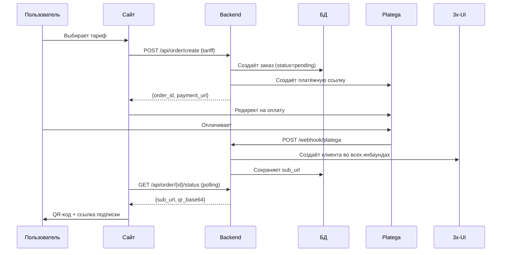

# 🚀 AWX-WEB-lite — VPN магазин

> **Версия:** 2.0  
> **Дата:** 2 августа 2026

Легковесная веб-витрина для продажи VPN-подписок с интеграцией **Platega** (оплата) + **3x-UI панель** (выдача ключей) + **Личный кабинет**.

---

## 📦 Возможности

**Backend (Python FastAPI):**
- ✅ API тарифов (`/api/tariffs`)
- ✅ Создание заказа + интеграция Platega (`/api/order/create`)
- ✅ Webhook для подтверждения оплаты (`/webhook/platega`)
- ✅ Автоматическое создание клиента в 3x-UI после оплаты
- ✅ Страница успеха с QR-кодом и sub-ссылкой
- ✅ **Личный кабинет** — JWT авторизация, управление подписками
- ✅ **Админ-панель** — просмотр заказов, статистика, retry

**Frontend (HTML + Tailwind CSS):**
- ✅ Главная страница с hero-секцией (Quantum тарифы)
- ✅ Блок возможностей (5 устройств, безлимит,多服务器)
- ✅ Карточки тарифов с автоматическими скидками
- ✅ FAQ секция
- ✅ **Личный кабинет** — вход/регистрация, подписки, ключи, QR
- ✅ Адаптивный дизайн (mobile-first)

**База данных (SQLite + WAL):**
- Таблица `users` — аккаунты пользователей
- Таблица `orders` — история заказов, привязка к 3x-UI и пользователям

---

## ⚙️ Быстрый старт

### 1️⃣ Установка зависимостей

```bash
cd backend
python -m venv venv

# Windows
venv\Scripts\activate

# Linux/Mac
source venv/bin/activate

pip install -r requirements.txt
```

### 2️⃣ Настройка `.env`

Скопируйте `.env.example` → `.env` и заполните:

```env
# ===== 3x-UI панель =====
XUI_BASE_URL=https://your-panel-host:port/webBasePath
XUI_API_TOKEN=your_bearer_token

# Все видимые инбаунды через запятую
XUI_INBOUND_IDS=5,6,7,8,10,12,13,14

# Базовый URL subscription-сервера
XUI_SUB_BASE_URL=https://your-panel-host:2096/sub/

# ===== Platega =====
PLATEGA_MERCHANT_ID=your_merchant_id
PLATEGA_SECRET=your_api_key
PLATEGA_API_URL=https://app.platega.io

# ===== Сайт =====
SITE_BASE_URL=https://your-domain.com
DATABASE_PATH=orders.db

# ===== Авторизация =====
JWT_SECRET=your-secret-key-min-32-chars

# ===== Админ-панель =====
ADMIN_API_KEY=your-admin-api-key

# ===== CORS =====
ALLOWED_ORIGINS=["https://your-domain.com"]
```

### 3️⃣ Запуск backend

```bash
# Development
python main.py

# Production (рекомендуется)
uvicorn main:app --host 0.0.0.0 --port 8000
```

Backend будет доступен на `http://localhost:8000`

### 4️⃣ Открытие frontend

Просто откройте `frontend/index.html` в браузере или разместите на веб-сервере.

**Важно:** В `frontend/index.html` и `frontend/account.html` измените:
```javascript
const API_BASE = 'http://localhost:8000'; // Измените на ваш домен
```

---

## 🔄 Как работает покупка



---

## 📋 API Эндпоинты

### Публичные
| Метод | Путь | Описание |
|---|---|---|
| `GET` | `/api/tariffs` | Список тарифов |
| `POST` | `/api/order/create` | Создание заказа |
| `GET` | `/api/order/{id}/status` | Статус заказа |
| `POST` | `/webhook/platega` | Webhook от Platega |

### Авторизация
| Метод | Путь | Описание |
|---|---|---|
| `POST` | `/api/auth/register` | Регистрация (email + пароль) |
| `POST` | `/api/auth/login` | Вход (email + пароль → JWT) |
| `GET` | `/api/auth/me` | Текущий пользователь |

### Личный кабинет
| Метод | Путь | Описание |
|---|---|---|
| `GET` | `/api/account/subscriptions` | Список подписок |
| `GET` | `/api/account/subscription/{id}` | Детали подписки + QR |
| `POST` | `/api/account/renew/{id}` | Продление подписки |

### Админ-панель
| Метод | Путь | Описание |
|---|---|---|
| `GET` | `/admin/orders` | Список заказов |
| `GET` | `/admin/orders/{id}` | Детали заказа |
| `POST` | `/admin/orders/{id}/retry` | Повтор failed заказа |
| `GET` | `/admin/stats` | Статистика |
| `POST` | `/admin/tariffs` | Обновление тарифов |

---

## 🏠 Личный кабинет

Пользователи могут:
- Зарегистрировать аккаунт (email + пароль)
- Войти в личный кабинет
- Просматривать все свои подписки
- Показать ключ подписки и QR-код
- Продлить активную подписку

Страница ЛК: `frontend/account.html`

---

## 🔐 Безопасность

1. **Bearer-токен 3x-UI** — храните в `.env`, никогда не коммитьте
2. **JWT_SECRET** — используйте сложный случайный ключ (минимум 32 символа)
3. **HTTPS обязателен** — без него токены летят открытым текстом
4. **CSP заголовки** — Content-Security-Policy настроен по умолчанию
5. **Rate limiting** — 10 заказов/час, 30 запросов статуса/мин
6. **XSS защита** — все пользовательские данные экранируются

---

## 🛠️ Настройка webhook в Platega

1. Зайдите в личный кабинет Platega
2. **Настройки** → **Webhook URL**
3. Укажите: `https://your-domain.com/webhook/platega`
4. Сохраните

Если webhook не работает — сайт использует **polling** (опрашивает Platega автоматически).

---

## 🌐 Деплой на сервер

### Nginx конфигурация

```nginx
server {
    listen 443 ssl http2;
    server_name your-domain.com;

    ssl_certificate /etc/letsencrypt/live/your-domain.com/fullchain.pem;
    ssl_certificate_key /etc/letsencrypt/live/your-domain.com/privkey.pem;

    # Frontend
    location / {
        root /var/www/awx-web-lite/frontend;
        try_files $uri $uri/ /index.html;
    }

    # Backend API
    location /api/ {
        proxy_pass http://127.0.0.1:8000;
        proxy_set_header Host $host;
        proxy_set_header X-Real-IP $remote_addr;
    }

    location /webhook/ {
        proxy_pass http://127.0.0.1:8000;
        proxy_set_header Host $host;
        proxy_set_header X-Real-IP $remote_addr;
    }

    location /payment/ {
        proxy_pass http://127.0.0.1:8000;
        proxy_set_header Host $host;
        proxy_set_header X-Real-IP $remote_addr;
    }

    location /admin/ {
        proxy_pass http://127.0.0.1:8000;
        proxy_set_header Host $host;
        proxy_set_header X-Real-IP $remote_addr;
    }
}
```

### Systemd сервис (backend)

```ini
[Unit]
Description=AWX VPN Backend
After=network.target

[Service]
User=www-data
WorkingDirectory=/var/www/awx-web-lite/backend
Environment="PATH=/var/www/awx-web-lite/backend/venv/bin"
ExecStart=/var/www/awx-web-lite/backend/venv/bin/uvicorn main:app --host 127.0.0.1 --port 8000
Restart=always

[Install]
WantedBy=multi-user.target
```

---

## 📊 Структура проекта

```
AWX-WEB-lite/
├── backend/
│   ├── .env.example          # Шаблон конфигурации
│   ├── requirements.txt      # Зависимости Python
│   ├── config.py             # Настройки из .env
│   ├── auth.py               # JWT авторизация
│   ├── admin.py              # Админ-панель API
│   ├── database.py           # SQLite + миграции
│   ├── xui_client.py         # Клиент 3x-UI API
│   ├── platega_client.py     # Клиент Platega API
│   └── main.py               # FastAPI приложение
├── frontend/
│   ├── index.html            # Лендинг (витрина)
│   └── account.html          # Личный кабинет
└── start.bat                 # Быстрый старт (Windows)
```

---

## ❓ FAQ

### Как изменить тарифы?

Отредактируйте `backend/config.py`:

```python
tariffs: dict = {
    "quantum_month": {"days": 31, "price": 300, "title": "Quantum Месяц", "devices": 5, "discount": 0},
    "quantum_quarter": {"days": 93, "price": 855, "title": "Quantum 3 Месяца", "devices": 5, "discount": 5},
}
```

Или через админ-панель: `POST /admin/tariffs`

### Как добавить серверы?

В `.env` укажите ID инбаундов через запятую:

```env
XUI_INBOUND_IDS=5,6,7,8,10,12,13,14
```

### Как зайти в админ-панель?

1. Задайте `ADMIN_API_KEY` в `.env`
2. Отправляйте запросы с заголовком `X-Admin-Key: ваш_ключ`

---

## 📝 Лицензия

MIT License

---

**Создано:** 2 августа 2026  
**Автор:** Claude Code
