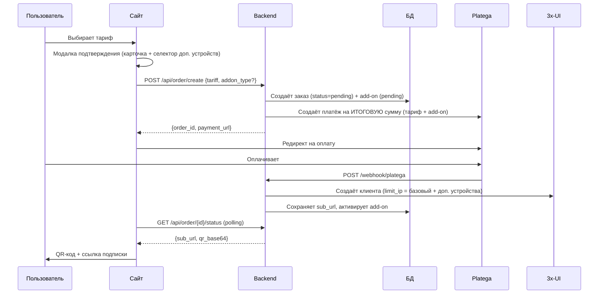

# 🚀 AWX-WEB-lite — VPN магазин

> **Версия:** 2.4  
> **Дата:** 5 августа 2026

Легковесная веб-витрина для продажи VPN-подписок с интеграцией **Platega** (оплата) + **3x-UI панель** (выдача ключей) + **Личный кабинет**.

---

## 📦 Возможности

**Backend (Python FastAPI):**
- ✅ API тарифов (`/api/tariffs`)
- ✅ Создание заказа + интеграция Platega (`/api/order/create`)
- ✅ Webhook для подтверждения оплаты (`/webhook/platega`)
- ✅ Автоматическое создание клиента в 3x-UI после оплаты
- ✅ Страница успеха с QR-кодом и sub-ссылкой
- ✅ **Личный кабинет** — JWT авторизация, управление подписками
- ✅ **Админ-панель** — dashboard, пользователи, ключи, статистика, настройки
- ✅ **Реферальная программа** — до 3 уровней, бонусные дни
- ✅ **Демо-режим** — подписка без оплаты (по паролю, для тестирования)
- ✅ **Триал** — бесплатный доступ на N дней (rate-limit 1/день)
- ✅ Верификация email (опционально)
- ✅ **Device Upsell** — покупка доп. устройств (+5/+10) с пропорциональной оплатой
- ✅ **Экран подтверждения покупки** — при оформлении тарифа: карточка заказа с селектором доп. устройств и динамическим пересчётом итоговой суммы
- ✅ **Группы тарифов** — группировка тарифов (Quantum и др.), создание групп и тарифов из админки, свой набор инбаундов 3x-UI на группу и на тариф (приоритет тариф → группа → все)
- ✅ **Брендинг из админки** — название сайта, акцентный цвет, контакт поддержки (применяется на витрине и в ЛК)
- ✅ **Экспорт/импорт настроек** — полный бэкап (тарифы, группы, брендинг, триал, рефералка, промо) в JSON и восстановление из админки
- ✅ **Общий лог действий** (`site_log`) — запись ключевых событий (регистрация, вход, заказы, выдача, админ-действия), просмотр и скачивание из админки, автопрунинг до 5000 записей
- ✅ **Авторизация через Telegram** — вход/регистрация через Telegram Login Widget, привязка Telegram к аккаунту в ЛК
- ✅ **Автоочистка** — удаление устаревших подписок (>14 дней) каждые 6 часов
- ✅ **Дебаг-песочница биллинга** — `/admin/debug/*`: симуляция оплат, принудительная выдача/отмена аддонов, продление, force-sync с 3x-UI, калькулятор proration (без реальных платежей)

**Frontend (HTML):**
- ✅ Главная страница с hero-секцией (Quantum тарифы)
- ✅ Карточки тарифов с автоматическими скидками
- ✅ Карточка демо-подписки (по паролю, для тестирования)
- ✅ FAQ секция
- ✅ **Личный кабинет** — вход/регистрация, подписки, ключи, QR
- ✅ Управление подпиской в ЛК: перевыпуск ключа, переименование, статистика, удаление
- ✅ **Покупка доп. устройств** — модалка с выбором +5/+10, расчёт proration, отмена
- ✅ **Экран подтверждения покупки** — модалка с селектором доп. устройств и итоговой суммой перед оплатой
- ✅ **Админ-панель** (`admin.html`) — отдельное SPA с авторизацией по X-Admin-Key
- ✅ **Вкладка «Дебаг»** в админ-панели — инспектор пользователя, симулятор оплат, force-sync, финансовый таймлайн, калькулятор proration
- ✅ **Вкладка «Логи»** в админ-панели — просмотр и скачивание общего лога действий
- ✅ **Кнопка «Устройства»** у ключа в админке — задать лимит устройств (синхронизация с 3x-UI и ЛК)
- ✅ **Редактор групп тарифов** в админке — создание групп, привязка тарифов, инбаунды группы и тарифа
- ✅ **Витрина по группам** — тарифы рендерятся секциями по группам (Quantum и др.), у каждой карточки своё число устройств
- ✅ **Кнопка «Войти через Telegram»** в логине + привязка Telegram в личном кабинете
- ✅ Адаптивный дизайн (mobile-first)

**База данных (SQLite + WAL):**
- Таблица `users` — аккаунты пользователей (+ блокировка, реферальный код)
- Таблица `orders` — история заказов, привязка к 3x-UI и пользователям
- Таблица `referrals` — связи «пригласил → приглашён»
- Таблица `referral_settings` — настройки реферальной программы
- Таблица `device_addons` — дополнительные устройства (add-on'ы)
- Таблица `site_log` — общий лог действий (автопрунинг до 5000 записей)
- Таблица `settings` — админ-настройки (тарифы, группы тарифов, триал, демо)
- Таблица `settings` — настройки, изменяемые из админ-панели
- Таблица `debug_audit_log` — журнал действий дебаг-песочницы (кто/что/когда)
- Колонка `is_test_account` в `users` — пометка тестового аккаунта для песочницы

---

## ⚙️ Быстрый старт

### 1️⃣ Установка зависимостей

```bash
cd backend
python -m venv venv

# Windows
venv\Scripts\activate

# Linux/Mac
source venv/bin/activate

pip install -r requirements.txt
```

### 2️⃣ Настройка `.env`

Скопируйте `.env.example` → `.env` и заполните:

```env
# ===== 3x-UI панель =====
XUI_BASE_URL=https://your-panel-host:port/webBasePath
XUI_API_TOKEN=your_bearer_token

# Все видимые инбаунды через запятую
XUI_INBOUND_IDS=5,6,7,8,10,12,13,14

# Базовый URL subscription-сервера
XUI_SUB_BASE_URL=https://your-panel-host:2096/sub/

# ===== Platega =====
PLATEGA_MERCHANT_ID=your_merchant_id
PLATEGA_SECRET=your_api_key
PLATEGA_API_URL=https://app.platega.io

# ===== Сайт =====
SITE_BASE_URL=https://your-domain.com
DATABASE_PATH=orders.db

# ===== Авторизация =====
JWT_SECRET=your-secret-key-min-32-chars

# ===== Админ-панель =====
ADMIN_API_KEY=your-admin-api-key

# ===== CORS =====
ALLOWED_ORIGINS=["https://your-domain.com"]

# ===== Email verification =====
# false — аккаунт активен сразу после регистрации
EMAIL_VERIFICATION_REQUIRED=false

# ===== Trial =====
TRIAL_ENABLED=true
TRIAL_DAYS=3
TRIAL_GB=25

# ===== Demo mode =====
# "Демо подписка" выдаёт ключ БЕЗ оплаты — ТОЛЬКО для тестирования!
DEMO_MODE=true
DEMO_PASSWORD=AxZz123@Tt

# ===== Debug sandbox =====
# Биллинг-песочница для тестов (симуляция оплат БЕЗ реальных платежей).
# По умолчанию ВЫКЛЮЧЕНА (весь /admin/debug/* отвечает 404).
# Включайте ТОЛЬКО на отладочном стенде, НИКОГДА на проде с реальными платежами!
DEBUG_SANDBOX_ENABLED=false
```

### 3️⃣ Запуск backend

```bash
# Development
python main.py

# Production (рекомендуется)
uvicorn main:app --host 0.0.0.0 --port 8000
```

Backend будет доступен на `http://localhost:8000`

### 4️⃣ Открытие frontend

Просто откройте `frontend/index.html` в браузере или разместите на веб-сервере.

**Важно:** В `frontend/index.html` и `frontend/account.html` измените:
```javascript
const API_BASE = 'http://localhost:8000'; // Измените на ваш домен
```

---

## 🔄 Как работает покупка



---

## 📋 API Эндпоинты

### Публичные
| Метод | Путь | Описание |
|---|---|---|
| `GET` | `/api/config` | Публичная конфигурация (`demo_mode`) |
| `GET` | `/api/tariffs` | Тарифы: `{tariffs: [плоский список], groups: [{id,title,description,inbounds,tariffs}], ungrouped: [slug]}` — каждый тариф с `devices`, `discount`, эффективными `inbounds` и ценами add-on'ов |
| `POST` | `/api/order/create` | Создание заказа — `{tariff, addon_type?}` → платёжная ссылка на итоговую сумму |
| `POST` | `/api/order/demo` | Демо-заказ без оплаты (требует пароль, rate-limit 3/час) |
| `GET` | `/api/order/{id}/status` | Статус заказа (`sub_url`, QR) |
| `POST` | `/webhook/platega` | Webhook от Platega |

### Авторизация
| Метод | Путь | Описание |
|---|---|---|
| `POST` | `/api/auth/register` | Регистрация (email + пароль, опц. `referral_code`) |
| `GET` | `/api/auth/verify` | Верификация email |
| `POST` | `/api/auth/login` | Вход (email + пароль → JWT) |
| `GET` | `/api/auth/me` | Текущий пользователь |
| `POST` | `/api/auth/telegram` | Вход/регистрация через Telegram (`{id, first_name, ..., hash}`) |
| `POST` | `/api/auth/telegram/bind` | Привязка Telegram к текущему аккаунту |

### Личный кабинет (`/api/account`)
| Метод | Путь | Описание |
|---|---|---|
| `GET` | `/subscriptions` | Список подписок |
| `GET` | `/subscription/{id}` | Детали подписки + QR |
| `POST` | `/renew/{id}` | Продление подписки |
| `POST` | `/subscription/{id}/rekey` | Перевыпуск ключа (сохраняет остаток времени) |
| `POST` | `/subscription/{id}/rename` | Переименование подписки |
| `GET` | `/subscription/{id}/stats` | Статистика ключа (трафик, лимит, даты) |
| `DELETE` | `/subscription/{id}` | Удаление подписки |
| `GET` | `/trial` | Статус триала |
| `POST` | `/trial/activate` | Активация триала (rate-limit 1/день) |

### Реферальная программа (`/api/referral`)
| Метод | Путь | Описание |
|---|---|---|
| `GET` | `/code` | Мой реферальный код и ссылка |
| `GET` | `/stats` | Статистика (приглашено, бонусы) |
| `POST` | `/apply` | Применить реферальный код |

### Доп. устройства (`/api/account`)
| Метод | Путь | Описание |
|---|---|---|
| `GET` | `/subscription/{id}/addon-price?addon_type=` | Расчёт proration (P = ceil(B*(1-D)/T*R)) |
| `POST` | `/subscription/{id}/addon` | Покупка add-on → платёж Platega |
| `POST` | `/subscription/{id}/addon/cancel` | Отмена add-on (cancel_pending до конца периода) |
| `GET` | `/subscription/{id}/addons` | Список add-on'ов + суммарный лимит |
| `GET` | `/addon/{id}/status` | Polling статуса add-on после оплаты |

### Админ-панель (`/admin`, заголовок `X-Admin-Key`)
| Метод | Путь | Описание |
|---|---|---|
| `GET` | `/dashboard` | Сводка (пользователи, ключи, выручка) |
| `GET` | `/users` | Список пользователей (поиск, пагинация) |
| `GET` | `/users/{id}` | Профиль пользователя |
| `POST` | `/users/{id}/block` | Блокировка пользователя |
| `POST` | `/users/{id}/unblock` | Разблокировка |
| `GET` | `/keys` | Список ключей (фильтры) |
| `POST` | `/keys/{id}/extend` | Продление ключа |
| `POST` | `/keys/{id}/devices` | Задать лимит устройств ключа (тестовый инструмент, синхронизирует admin-аддон) |
| `POST` | `/keys/{id}/delete` | Удаление ключа |
| `GET` | `/stats` | Статистика (заказы по дням, топ тарифов, конверсия) |
| `GET` | `/settings` | Текущие настройки (тарифы, группы, `available_inbounds`, триал, рефералка) |
| `POST` | `/settings/tariffs` | Обновление тарифов (вкл. `inbounds`) |
| `POST` | `/settings/tariff_groups` | Сохранение групп тарифов (создание/редактирование/удаление, валидация) |
| `POST` | `/settings/branding` | Брендинг: `{site_name, accent_color, support_contact}` |
| `GET` | `/settings/export` | Экспорт всех настроек в JSON (бэкап) |
| `POST` | `/settings/import` | Импорт настроек из JSON (с валидацией) |
| `POST` | `/settings/trial` | Настройка триала |
| `POST` | `/settings/referral` | Настройка рефералки |
| `POST` | `/settings/demo` | Вкл/выкл демо-режим |
| `GET` | `/logs` | Последние N записей общего лога действий (`?limit=`) |
| `GET` | `/logs/download` | Скачать общий лог как текстовый файл (`?limit=`) |
| `POST` | `/cleanup` | Ручной запуск очистки устаревших записей |

### Дебаг-песочница (`/admin/debug`, заголовки `X-Admin-Key` + `X-Admin-Name`, только при `DEBUG_SANDBOX_ENABLED=true`)
| Метод | Путь | Описание |
|---|---|---|
| `POST` | `/proration-calc` | Калькулятор proration (read-only, численно = реальной формуле) |
| `GET` | `/timeline/{user_id}` | Финансовый таймлайн пользователя (заказы, аддоны, debug-события) |
| `GET` | `/user/{user_id}/devices?order_id=` | Инспектор лимита: тариф + аддоны + реальный лимит в 3x-UI |
| `POST` | `/user/{user_id}/devices/force-grant?order_id=` | Принудительная выдача add-on (минуя оплату) |
| `POST` | `/user/{user_id}/devices/force-cancel-pending?order_id=` | Имитация «отказаться» (→ `cancel_pending`) |
| `POST` | `/user/{user_id}/devices/force-finalize-cancel?order_id=` | Немедленное завершение отмены (лимит → база) |
| `POST` | `/user/{user_id}/devices/reset-all?order_id=` | Полный сброс add-on'ов заказа |
| `POST` | `/payment/mock-success` | Симуляция успешной оплаты (заказ → paid) |
| `POST` | `/payment/mock-fail` | Симуляция неуспешной оплаты (лимит в 3x-UI не трогается) |
| `POST` | `/payment/mock-pending` | Симуляция зависшей оплаты |
| `POST` | `/billing/simulate-renew` | Симуляция продления подписки |
| `GET` | `/billing/force-sync-preview?order_id=` | Двухшаговый sync — шаг 1: read-only diff БД vs 3x-UI |
| `POST` | `/billing/force-sync-apply` | Двухшаговый sync — шаг 2: применить ожидаемый лимит |

---

## 🏠 Личный кабинет

Пользователи могут:
- Зарегистрировать аккаунт (email + пароль, опционально реферальный код)
- Войти в личный кабинет
- Просматривать все свои подписки
- Показать ключ подписки и QR-код
- Продлить активную подписку
- **Перевыпустить ключ** — старый клиент удаляется в 3x-UI, создаётся новый с тем же остатком времени
- **Переименовать подписку** (пользовательское имя)
- Посмотреть **статистику ключа** (трафик up/down, лимит, дата окончания)
- **Удалить подписку**
- Активировать **бесплатный триал** (1 раз в день, если включён)
- Участвовать в **реферальной программе** — приглашать и получать бонусные дни
- **Докупить дополнительные устройства** (+5 или +10) с пропорциональной оплатой
- **Отказаться от доп. устройств** (лимит уменьшится при следующем продлении)

Страница ЛК: `frontend/account.html`

---

## 🎮 Демо-режим (для тестирования)

Демо-подписка выдаёт ключ **без оплаты** — удобно для отладки всего сценария выдачи ключа.

- Включить: `DEMO_MODE=true` в `.env` (по умолчанию выключен).
- Кнопка **«Демо подписка»** появляется на витрине только при `demo_mode=true` (витрина читает `GET /api/config`).
- Доступ защищён паролем: `DEMO_PASSWORD` вводится в модальном окне на витрине перед выдачей ключа.
- Rate-limit: **3 демо-заказа в час** с одного IP (защита от абьюза).
- После подтверждения сразу создаётся клиент в 3x-UI, страница успеха показывает ссылку и QR.
- В продакшене установите `DEMO_MODE=false`.

**Скрыть через админ-панель без изменения кода:** Админ-панель → Настройки → Демо (тумблер). Настройка сохраняется в БД и переживает перезапуск сервера.

---

## 🤝 Реферальная программа

Пользователи могут приглашать друзей и получать бонусные дни за их оплаты.

- Каждый пользователь получает уникальный **реферальный код** (8 символов).
- Ссылка для приглашения: `https://your-domain.com/?ref=CODE` (код подставляется автоматически).
- При регистрации можно указать чужой код — привязка реферала.
- Бонусные дни начисляются **автоматически при оплате** приглашённого.
- До **3 уровней** вложенности (высокие бонусы на 1-м уровне).
- Защита от циклов и повторного применения кода.

Настройка бонусов (проценты по уровням, включение/выключение): Админ-панель → Настройки → Рефералка.

---

## 🛒 Дополнительные устройства (Upsell)

Пользователи могут докупать слоты для устройств в любой момент в личном кабинете, а также **при оформлении новой подписки** — на экране подтверждения покупки.

### Пакеты
| Пакет | Доп. устройств | Базовая цена/мес |
|-------|---------------|-------------------|
| `devices_5` | +5 | 100 ₽ |
| `devices_10` | +10 | 170 ₽ |

### Покупка при оформлении подписки
- В модалке покупки тарифа есть селектор: **«Без доп. устройств»** (по умолчанию) / +5 / +10
- Итоговая сумма пересчитывается динамически; цены add-on'ов присылает `/api/tariffs` (сервер не доверяет цене клиента)
- Доп. устройства создаются как add-on (`device_addons`, status=`pending`) и активируются после подтверждения оплаты вместе с выдачей ключа
- `limit_ip` в 3x-UI сразу = базовый лимит тарифа + купленные доп. устройства
- Покупка с доп. устройствами требует авторизации (иначе `401`)
- Для новой подписки proration = полный период: `P = ceil(B × (1 − D))`, т.е. цена за весь срок с учётом скидки тарифа

### Как работает proration
Оплата рассчитывается **пропорционально** оставшимся дням текущего периода:

```
P = ceil(B × (1 - D) / T × R)
```
- **B** — базовая цена пакета (100 или 170 ₽)
- **D** — скидка основного тарифа (0.05, 0.10, 0.20)
- **T** — всего дней в периоде (31, 93, 186, 365)
- **R** — оставшихся дней до конца периода

### Лимиты и защита
- Лимит устройств **реально обновляется** в 3x-UI через `update_client_limit`
- Rate-limit: 1 добавление в 24 часа на пользователя
- Дублирование одного типа add-on запрещено
- Двойной клик «Оплатить» → защита от повторного создания pending add-on

### Отмена add-on
- При отмене ставится `cancel_pending`
- Лимит уменьшается только при следующем продлении подписки
- При продлении корректно пересчитывается: `base + все активные - отменяемые`

### Настройка в config.py
```python
device_addons: dict = {
    "devices_5":  {"extra_devices": 5,  "base_price": 100, "title": "+5 устройств"},
    "devices_10": {"extra_devices": 10, "base_price": 170, "title": "+10 устройств"},
}
```

---

## 🧪 Дебаг-песочница биллинга (Billing & Upsell Sandbox)

Отдельный раздел админ-панели для тестирования **биллинга и upsell-логики без реальных платежей**: симуляция оплат, принудительная выдача/отмена доп. устройств, продление подписки, синхронизация лимита с 3x-UI.

### Как включить

В `.env`:
```env
DEBUG_SANDBOX_ENABLED=true
```
и перезапустите сервер. **По умолчанию выключена** — весь раздел отвечает `404`, даже с правильным `X-Admin-Key`. Включайте только на отладочном стенде; **никогда не включайте на проде с реальными платежами** — инструменты умеют мутировать реальные лимиты в 3x-UI и обходить оплату по дизайну.

### Как пользоваться

1. Откройте `frontend/admin.html` → вкладка **«Дебаг»**.
2. Впишите имя оператора в поле **X-Admin-Name** — оно обязательно для всех действий.
3. Выберите пользователя/заказ и инструмент: инспектор, симулятор оплат, force-sync, таймлайн или калькулятор.

### Защита (как это устроено)

| Механизм | Что делает |
|---|---|
| `DEBUG_SANDBOX_ENABLED` | Флаг полной изоляции (router-level): выключен → весь раздел `404` |
| `X-Admin-Name` | Обязательный заголовок на всех POST — «кто отвечает за действие» (400 без него) |
| `confirm_email` | Действия на **реальном** (не тестовом) аккаунте требуют ввода его email точь-в-точь (400 иначе); тестовые аккаунты — без подтверждения |
| `is_test_account` | Флаг в `users` — помечайте тестовые аккаунты, чтобы не вводить email каждый раз |
| Двухшаговый force-sync | `preview` (read-only diff) → `apply` (мутация) — отдельным POST |
| `debug_audit_log` | Журнал всех действий: `admin_name`, `action`, `target_user_id`, `details` |
| Нет `platega_client` | Симулятор работает только через прямые вызовы `fulfill_order`/`fulfill_addon` — ни одного реального похода в Platega API |

### Быстрые сценарии

- **Проверка proration без покупки:** калькулятор → сравните `price_now` с тем, что показывает реальная покупка add-on.
- **Выдача add-on без оплаты:** force-grant на тестовом аккаунте → проверьте, что `limitIp` в 3x-UI вырос.
- **Неуспешная оплата:** mock-fail → убедитесь, что `limitIp` **не изменился**.
- **Расхождение лимита БД ↔ 3x-UI:** force-sync-preview покажет diff; force-sync-apply выровняет.

---

## 🧹 Автоочистка устаревших записей

Фоновый процесс запускается при старте сервера и работает **каждые 6 часов**.

- **Подписки**: заказы с `expires_at` >14 дней назад → удаление клиента из 3x-UI + DELETE из БД
- **Триалы**: `trial_started_at` / `trial_expires_at` старше14 дней → сброс в NULL
- Ручной запуск: `POST /admin/cleanup` (с X-Admin-Key)
- Не удаляются: заказы `pending`, `deleted`, без `expires_at`

---

## 🔐 Безопасность

1. **Bearer-токен 3x-UI** — храните в `.env`, никогда не коммитьте
2. **JWT_SECRET** — сложный случайный ключ (≥32 символов), fail-fast валидация при запуске
3. **HTTPS обязателен** — без него токены летят открытым текстом
4. **CSP заголовки** — Content-Security-Policy настроен по умолчанию
5. **Rate limiting** — 10 заказов/час, 30 запросов статуса/мин, 3 демо/час
6. **XSS защита** — все пользовательские данные экранируются
7. **Демо-пароль** — доступ к демо-подписке защищён паролем (`DEMO_PASSWORD`), можно скрыть через админку
8. **Real IP** — корректное определение IP за прокси (`X-Forwarded-For` / `X-Real-IP`)
9. **Capability-токен** — доступ к статусу заказа через `?token=...` (без токена — ключ не отдаётся)
10. **Renew rate-limit** — продление подписки не чаще 1 раза в сутки, после 70% срока
11. **asyncio.Lock** — защита `fulfill_order` и `fulfill_addon` от параллельных вызовов
12. **Webhook idempotent** — `check_status()` вызывается 1 раз, addon-first поиск, корректные возвраты
13. **Дебаг-песочница изолирована** — флаг `DEBUG_SANDBOX_ENABLED` (router-level 404), обязательный `X-Admin-Name`, `confirm_email` для реальных аккаунтов, двухшаговый force-sync, audit-лог, без импортов `platega_client`

---

## 🛠️ Настройка webhook в Platega

1. Зайдите в личный кабинет Platega
2. **Настройки** → **Webhook URL**
3. Укажите: `https://your-domain.com/webhook/platega`
4. Сохраните

Если webhook не работает — сайт использует **polling** (опрашивает Platega автоматически).

---

## 🌐 Деплой на сервер

### Nginx конфигурация

```nginx
server {
    listen 443 ssl http2;
    server_name your-domain.com;

    ssl_certificate /etc/letsencrypt/live/your-domain.com/fullchain.pem;
    ssl_certificate_key /etc/letsencrypt/live/your-domain.com/privkey.pem;

    # Frontend
    location / {
        root /var/www/awx-web-lite/frontend;
        try_files $uri $uri/ /index.html;
    }

    # Backend API
    location /api/ {
        proxy_pass http://127.0.0.1:8000;
        proxy_set_header Host $host;
        proxy_set_header X-Real-IP $remote_addr;
    }

    location /webhook/ {
        proxy_pass http://127.0.0.1:8000;
        proxy_set_header Host $host;
        proxy_set_header X-Real-IP $remote_addr;
    }

    location /payment/ {
        proxy_pass http://127.0.0.1:8000;
        proxy_set_header Host $host;
        proxy_set_header X-Real-IP $remote_addr;
    }

    location /admin/ {
        proxy_pass http://127.0.0.1:8000;
        proxy_set_header Host $host;
        proxy_set_header X-Real-IP $remote_addr;
    }
}
```

### Systemd сервис (backend)

```ini
[Unit]
Description=AWX VPN Backend
After=network.target

[Service]
User=www-data
WorkingDirectory=/var/www/awx-web-lite/backend
Environment="PATH=/var/www/awx-web-lite/backend/venv/bin"
ExecStart=/var/www/awx-web-lite/backend/venv/bin/uvicorn main:app --host 127.0.0.1 --port 8000
Restart=always

[Install]
WantedBy=multi-user.target
```

---

## 📊 Структура проекта

```
AWX-WEB-lite/
├── backend/
│   ├── .env.example          # Шаблон конфигурации
│   ├── requirements.txt      # Зависимости Python
│   ├── config.py             # Настройки из .env
│   ├── auth.py               # JWT авторизация
│   ├── admin.py              # Админ-панель API
│   ├── admin_debug.py        # Дебаг-песочница биллинга (/admin/debug/*)
│   ├── database.py           # SQLite + миграции
│   ├── pricing.py            # Формула proration (единый источник правды)
│   ├── xui_client.py         # Клиент 3x-UI API
│   ├── platega_client.py     # Клиент Platega API
│   └── main.py               # FastAPI приложение
├── frontend/
│   ├── index.html            # Лендинг (витрина)
│   ├── account.html          # Личный кабинет
│   ├── admin.html            # Админ-панель (SPA)
│   ├── privacy.html          # Политика конфиденциальности
│   └── terms.html            # Пользовательское соглашение
└── start.bat                 # Быстрый старт (Windows)
```

---

## ❓ FAQ

### Как изменить тарифы?

Отредактируйте `backend/config.py` (дефолты) **или** через админ-панель → «Настройки» → «Тарифы» (сохраняется в БД и перекрывает дефолты):

```python
tariffs: dict = {
    "quantum_month": {"days": 31, "price": 300, "title": "Quantum Месяц", "devices": 5, "discount": 0, "inbounds": []},
    "quantum_quarter": {"days": 93, "price": 855, "title": "Quantum 3 Месяца", "devices": 5, "discount": 5, "inbounds": []},
}
```

**Группы тарифов.** В админ-панели → «Настройки» → «Группы тарифов» можно создавать/редактировать/удалять группы (например Quantum), привязывать к ним тарифы и задавать инбаунды:

```python
tariff_groups: dict = {
    "quantum": {"id": "quantum", "title": "Quantum", "description": "Смарт-сеть",
                "inbounds": [5, 6, 7], "tariffs": ["quantum_month", "quantum_quarter"]},
}
```

**Инбаунды.** Приоритет для тарифа: `тариф.inbounds` → `группа.inbounds` → все из `XUI_INBOUND_IDS`. Клиент в 3x-UI создаётся только в этих инбаундах.

### Как добавить серверы?

Пока сайт работает с одним 3x-UI сервером (из `.env`). Мультисервер с разделом «Сервера» в админке — в планах (идея #2):

```env
XUI_BASE_URL=https://panel.example.com:2053/yourpath
XUI_API_TOKEN=...
XUI_SUB_BASE_URL=https://panel.example.com:2096/sub
XUI_INBOUND_IDS=5,6,7,8,10,12,13,14
```

### Как зайти в админ-панель?

1. Задайте `ADMIN_API_KEY` в `.env` (случайная строка, ≥16 символов)
2. Откройте `frontend/admin.html` в браузере
3. Введите ключ в поле авторизации
4. Управление: dashboard, пользователи, ключи, статистика, настройки

### Как включить демо-режим?

В `.env`:
```
DEMO_MODE=true
DEMO_PASSWORD=your-secret-password
```
На витрине появится карточка **«Демо подписка»**. После ввода пароля ключ выдаётся мгновенно без оплаты.

Для скрытия кнопки в продакшене: `DEMO_MODE=false` или через админ-панель (Настройки → Демо).

### Как работает реферальная программа?

1. Пользователь получает свой код в Личном кабинете (раздел «Реферальная программа»)
2. Приглашённые входят по `?ref=CODE`
3. При оплате приглашённого реферер получает бонусные дни
4. До 3 уровней вложенности
5. Настройка бонусов: Админ-панель → Настройки → Рефералка

### Как докупить дополнительные устройства?

**При оформлении новой подписки:** в модалке покупки тарифа выберите пакет (+5 / +10) — итоговая сумма пересчитается автоматически, и лимит устройств сразу будет применён при выдаче ключа.

**Для уже существующей подписки:**
1. В личном кабинете нажать «Устройства» в карточке подписки
2. Выбрать пакет: +5 (100₽) или +10 (170₽)
3. Система покажет пропорциональную стоимость (за оставшиеся дни)
4. Оплатить через Platega → лимит обновится в 3x-UI мгновенно
5. Отмена: «Отказаться от доп. устройств» → лимит уменьшится при следующем продлении

### Как тестировать биллинг без реальных платежей?

Включите `DEBUG_SANDBOX_ENABLED=true` в `.env`, откройте админку → вкладка **«Дебаг»**. Симулируйте оплаты (mock-success/fail/pending), принудительно выдавайте/отменяйте add-on'ы, продлевайте подписки и синхронизируйте лимит с 3x-UI. Все действия требуют `X-Admin-Name`, на реальных аккаунтах — подтверждения email. **Никогда не включайте на проде.**

---

## 📝 Лицензия

MIT License

---

**Создано:** 2 августа 2026
**Обновлено:** 4 августа 2026
**Автор:** Claude Code

---

## 📝 Чек-лист деплоя

1. Скопировать `.env.example` → `.env`, заполнить секреты
2. Установить зависимости: `pip install -r requirements.txt`
3. Настроить webhook Platega → `https://your-domain.com/webhook/platega`
4. Настроить nginx (см. секцию «Деплой»)
5. Запустить: `uvicorn main:app --host 127.0.0.1 --port 8000`
6. Открыть `frontend/admin.html` → ввести `ADMIN_API_KEY`
7. Включить демо-режим в админке для тестирования
8. Протестировать: покупка, webhook, ключ, доп. устройства
